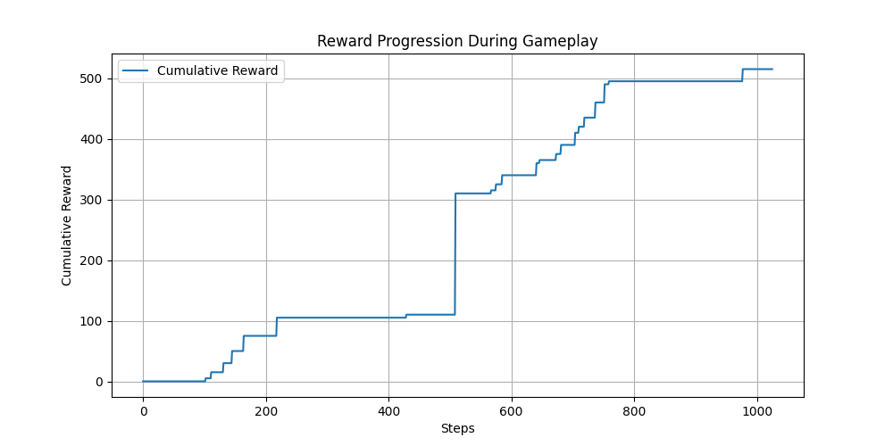
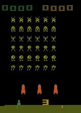

# **README.md**

# DQN from Scratch on Atari Space Invaders

This repository contains a **Deep Q-Network (DQN) implementation from scratch** for playing **Atari Space Invaders**. The agent is trained using reinforcement learning techniques to maximize cumulative rewards in the game.

## 📜 **Overview**

DQN (Deep Q-Network) is a **value-based reinforcement learning algorithm** that learns optimal policies for an agent interacting with an environment. This implementation is built from scratch using **PyTorch** and **OpenAI Gym (Atari)**.

Key features:

- Implements **experience replay** and **target network stabilization**.
- Uses **epsilon-greedy exploration** for efficient learning.
- Trains a convolutional neural network (CNN) to approximate Q-values.
- Saves trained models and logs training performance.

## 🏆 **Results**

Below is the **cumulative reward graph** showing the agent's learning progress over training episodes.



- The agent starts with **random actions** but gradually improves its strategy.
- As training progresses, **reward accumulation stabilizes**, indicating better gameplay performance.

## 🎮 **Rollout Video**

Watch the trained agent in action:



## 🛠 **Implementation Details**

- **Environment:** `gym.make('SpaceInvaders-v4')`
- **Frameworks Used:** `PyTorch`, `OpenAI Gym`, `Matplotlib`
- **DQN Improvements:**
  - Experience Replay
  - Target Network
  - Reward Clipping
  - Frame Stacking

## 📌 **File Structure**

```
│── assets/                     # Stores images & rollout video
│   ├── redward_graph.png
│   ├── roll_out.mp4
│── dqn.py                       # DQN implementation
│── train.py                      # Training script
│── test.py                        # Run trained model
│── record_video.py                # Generates rollout video
│── utils.py                       # Helper functions
│── requirements.txt               # Dependencies
│── README.md                      # Project documentation
```

## 📈 **Future Improvements**

- Implement **Double DQN** to reduce Q-value overestimation.
- Use **Dueling DQN** for better state value estimation.
- Experiment with **Prioritized Experience Replay**.

🚀 **Happy Reinforcement Learning!**
